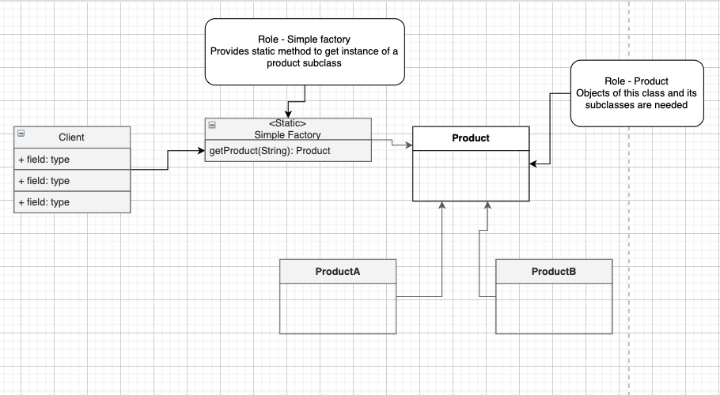

# Java Design Patterns Studies

This code is only for reference for show use cases
where design patterns are useful to solve problems.
All code is from the course: 
[Java Design Patterns & SOLID Design Principles](https://www.udemy.com/course/design-patterns-in-java-concepts-hands-on-projects/)

Summary:
- [SOLID](#SOLID)
    - [Single Responsibility Principle](#SINGLE-RESPONSIBILITY-PRINCIPLE)
    - [Open-Closed Principle](#open-closed-principle)
    - [Liskov Substitution Principle](#liskov-substitution-principle)
    - [Interface Segregation Principle](#interface-segregation-principle)
    - [Dependency Inversion Principle](#dependency-inversion-principle)
- [Design Patterns](#design-patterns)
    - [Creational Patterns](#creational-patterns)
        - [Builder](#builder-pattern)
            - [Implementations](#builder-implementations)     
            - [Comparison with Prototype](#comparison-between-builder-and-prototype)
            - [Pitfalls](#builder-pitfalls)
        - [Simple Factory](#simple-factory-pattern)
            - [Diagram](#simple-factory-diagram)
            - [usecases](#simple-factory-use-case)
            - [Comparison with factory method patttern](#comparison-between-simple-factory-and-factory-method-pattern)            
            - [Consideration](#simple-factory-considerations)
            - [Pitfalls](#simple-factory-pitfalls)
            
     
## SOLID

SOLID is an acronym for the following principles:

- Single Responsibility Principle
- Open Closed Principle
- Liskov substitution Principle
- Interface Segregation Principle
- Dependency Inversion Principle

### Single Responsibility Principle

As the same suggest, a class should only be focused on handling
a specific task. In other words:

<i>A Class should have only one reason to change.</i>

Example:
- A class handling a request should not be changed if the validation changes.
- A class handling a request should not be  changed if the persistence logic changes.

Code 
```java
public class UserController {
    public String createUser(String userJson) throws IOException {
            /* Parsing Logic */
            ObjectMapper mapper = new ObjectMapper();
            User user = mapper.readValue(userJson, User.class);
    
            /* Breaking Single Responsibility Principle
            * Should be handled by another class*/
            if(!isValidUser(user)) {
                return "Error";
            }
            
    
    //      Another violation of the SRP - class is now handling persistence logic
            store.store(user);
            
            return "SUCCESS";
        } 
}
```

Problems addressed by this class:
- parsing
- object validation
- persistence logic

A more SOLID code would be: 

```java
//Handles incoming JSON requests that work on User
public class UserController {

    private Store store = new Store();

    private UserPersistenceService persistenceService = new UserPersistenceService();

    //Create a new user - Controller method should only receive a request
    public String createUser(String userJson) throws IOException {
        /* Parsing Logic */
        ObjectMapper mapper = new ObjectMapper();
        User user = mapper.readValue(userJson, User.class);

        /* Validation Logic */
        UserValidator validator = new UserValidator();
        boolean valid = validator.validateUser(user);

        if(!valid) {
            return "ERROR";
        }

        persistenceService.saveUser(user);

        return "SUCCESS";
    }

}
```

Problems Addressed:
- Validation logic handled outside of the controller
- Persistence logic handled outside of the controller

Another thing that could be done would be to have a separate class to do parsing.

### Open-Closed Principle

"Modules or classes should be open for extension, but closed for modification."

Open for extension: We should be able to extend a existing behavior
Closed for modification: Existing code remains unchanged.

An example of the usage of the open-closed principle would be to identify
a common behavior or set of parameters that are used across multiple classes.

```java
public class PhoneSubscriber {

    private Long subscriberId;

    private String address;

    private Long phoneNumber;

    private int baseRate;

    public double calculateBill() {
        List<CallHistory.Call> sessions = CallHistory.getCurrentCalls(subscriberId);
        long totalDuration = sessions.stream().mapToLong(CallHistory.Call::getDuration).sum();
        return totalDuration*baseRate/100;
    }

    /**
     * @return the subscriberId
     */
    public Long getSubscriberId() {
        return subscriberId;
    }

    /**
     * @param subscriberId the subscriberId to set
     */
    public void setSubscriberId(Long subscriberId) {
        this.subscriberId = subscriberId;
    }

    /**
     * @return the address
     */
    public String getAddress() {
        return address;
    }

    /**
     * @param address the address to set
     */
    public void setAddress(String address) {
        this.address = address;
    }

    /**
     * @return the phoneNumber
     */
    public Long getPhoneNumber() {
        return phoneNumber;
    }

    /**
     * @param phoneNumber the phoneNumber to set
     */
    public void setPhoneNumber(Long phoneNumber) {
        this.phoneNumber = phoneNumber;
    }

    /**
     * @return the baseRate
     */
    public int getBaseRate() {
        return baseRate;
    }

    /**
     * @param baseRate the baseRate to set
     */
    public void setBaseRate(int baseRate) {
        this.baseRate = baseRate;
    }

}
``` 

And

```java
package Solid.OpenClosed;

import java.util.List;

public class PhoneSubscriber {

    private Long subscriberId;

    private String address;

    private Long phoneNumber;

    private int baseRate;

    public double calculateBill() {
        List<CallHistory.Call> sessions = CallHistory.getCurrentCalls(subscriberId);
        long totalDuration = sessions.stream().mapToLong(CallHistory.Call::getDuration).sum();
        return totalDuration*baseRate/100;
    }

    /**
     * @return the subscriberId
     */
    public Long getSubscriberId() {
        return subscriberId;
    }

    /**
     * @param subscriberId the subscriberId to set
     */
    public void setSubscriberId(Long subscriberId) {
        this.subscriberId = subscriberId;
    }

    /**
     * @return the address
     */
    public String getAddress() {
        return address;
    }

    /**
     * @param address the address to set
     */
    public void setAddress(String address) {
        this.address = address;
    }

    /**
     * @return the phoneNumber
     */
    public Long getPhoneNumber() {
        return phoneNumber;
    }

    /**
     * @param phoneNumber the phoneNumber to set
     */
    public void setPhoneNumber(Long phoneNumber) {
        this.phoneNumber = phoneNumber;
    }

    /**
     * @return the baseRate
     */
    public int getBaseRate() {
        return baseRate;
    }

    /**
     * @param baseRate the baseRate to set
     */
    public void setBaseRate(int baseRate) {
        this.baseRate = baseRate;
    }

}
```

Both classes have params and a method in common.
This could be simplified using the Open-Closed principle
moving what is shared among them into a abstract class(closed for modification):

```java
package Solid.OpenClosed;

/* Base class - closed for modification */
public abstract class Subscriber {
    protected Long subscriberId;

    protected String address;

    protected Long phoneNumber;

    protected int baseRate;

    public abstract double calculateBill(); /* open for extension */

    public int getBaseRate() {
        return baseRate;
    }

    public void setBaseRate(int baseRate) {
        this.baseRate = baseRate;
    }

    public Long getSubscriberId() {
        return subscriberId;
    }

    public void setSubscriberId(Long subscriberId) {
        this.subscriberId = subscriberId;
    }

    public String getAddress() {
        return address;
    }

    public void setAddress(String address) {
        this.address = address;
    }

    public Long getPhoneNumber() {
        return phoneNumber;
    }

    public void setPhoneNumber(Long phoneNumber) {
        this.phoneNumber = phoneNumber;
    }
}
```

Now that we have created a base class, the inheritance will help us 
reducing the amount of code in the other classes while also leaving the behavior
open for any other use-case:


ISP Class
````java
package Solid.OpenClosed;

import java.util.List;

public class ISPSubscriber extends Subscriber {

    private long freeUsage;

    public ISPSubscriber() {

    }

    public double calculateBill() {
        List<InternetSessionHistory.InternetSession> sessions = InternetSessionHistory.getCurrentSessions(subscriberId);
        long totalData = sessions.stream().mapToLong(InternetSessionHistory.InternetSession::getDataUsed).sum();
        long chargeableData = totalData - freeUsage;
        return chargeableData*baseRate/100;
    }

    /**
     * @return the freeUsage
     */
    public long getFreeUsage() {
        return freeUsage;
    }

    /**
     * @param freeUsage the freeUsage to set
     */
    public void setFreeUsage(long freeUsage) {
        this.freeUsage = freeUsage;
    }

    
}
````

```java
package Solid.OpenClosed;

import java.util.List;

public class PhoneSubscriber extends Subscriber{

    public double calculateBill() {
        List<CallHistory.Call> sessions = CallHistory.getCurrentCalls(subscriberId);
        long totalDuration = sessions.stream().mapToLong(CallHistory.Call::getDuration).sum();
        return totalDuration*baseRate/100;
    }

}
```

### Liskov Substitution Principle

_We should be to substitute base class objects with child class objects 
and this should not alter behavior/characteristics of program_


If the base class specifies a behavior A and if that class is substituted by
a child class, that behavior should not alter.

For example:

````java
package Solid.LiskovSubstitution;

public class Square extends Rectangle {
	
	public Square(int side) {
		super(side, side);
	}
	
	@Override
	public void setWidth(int width) {
		setSide(width);
	}

	@Override
	public void setHeight(int height) {
		setSide(height);
	}

	public void setSide(int side) {
		super.setWidth(side);
		super.setHeight(side);
	}

}
````

````java
package Solid.LiskovSubstitution;

public class Rectangle {

	private int width;
	
	private int height;

	public Rectangle(int width, int height) {
		this.width = width;
		this.height = height;
	}

	public int getWidth() {
		return width;
	}

	public void setWidth(int width) {
		this.width = width;
	}

	public int getHeight() {
		return height;
	}

	public void setHeight(int height) {
		this.height = height;
	}
	
	public int computeArea() {
		return width * height;
	}
}
````

In our main class, our tests will fail in the square use case.
It happens because the Square class, as shown before, overrides the setHeight
and setWidth method which in the end modifies the original behavior of the class.

````java
package Solid.LiskovSubstitution;

public class Main {

	public static void main(String[] args) {
		
		Rectangle rectangle = new Rectangle(10, 20);
		System.out.println(rectangle.computeArea());
		
		Square square = new Square(10);
		System.out.println(square.computeArea());
		
		useRectangle(rectangle);
		
		useRectangle(square);

	}

	private static void useRectangle(Rectangle rectangle) {
		/* Square class will fail:
		* - even a valid square class will in the end fail this tests
		* - modified the behavior of the base class
		* */
		rectangle.setHeight(20);
		rectangle.setWidth(30);
		assert rectangle.getHeight() == 20 : "Height Not equal to 20";
		assert rectangle.getWidth() == 30 : "Width Not equal to 30";
	}
}
````

This problem can be solved by creating a contract which our classes will implement:

````java
package Solid.LiskovSubstitution;

public interface Shape {
    public int computeArea();
}
````

By replacing the Rectangle extension from the Square class, and implementing
the Shape class we will ensure the Liskov Principle doesn't get broken as it was before.
Now a derived class is not changing the behavior of the parent class anymore and a new 
test case for Square shall be written:

````java
package Solid.LiskovSubstitution;

public class Square implements Shape {

	public int side;
	
	public Square(int side) {
		this.side = side;
	}

	public void setSide(int side) {
		this.side = side;
	}

	@Override
	public int computeArea() {
		return this.side * this.side;
	}
}
````

### Interface Segregation Principle

_Clients should not be forced to depend upon interfaces that they do not use_

In other words, clients should not depend on methods that they don't use..

**Interface Polution**

The practice to gather unrelated methods into a single interface, 
making it larger and obscure.

Signs of Interface Polution:
- Classes have empty method implementations
- Method implementations throw UnsupportedOperationException or similar exception
- Method implementations return null or default/dummy values

Interface Segregation makes sure our interfaces/contracts are clean and only have methods related to each other.

Example:

Let's say we have 3 Service implementations and only a single
interface to declare the methods they should implement.

````java
package Solid.InterfaceSegregation.service;

import Solid.InterfaceSegregation.entity.Entity;

import java.util.List;

//common interface to be implemented by all persistence services.
public interface PersistenceService<T extends Entity> {

	public void save(T entity);
	
	public void delete(T entity);
	
	public T findById(Long id);

	public List<T> findByName(String name);
	
}
````

And our two service classes implementing this PersistenceService

````java
package Solid.InterfaceSegregation.service;

import java.util.HashMap;
import java.util.List;
import java.util.Map;
import java.util.stream.Collectors;

import Solid.InterfaceSegregation.entity.User;

//Stores User entities
public class UserPersistenceService implements PersistenceService<User>{
	
	private static final Map<Long, User> USERS = new HashMap<>();
	
	@Override
	public void save(User entity) {
		synchronized (USERS) {
			USERS.put(entity.getId(), entity);
		}
	}

	@Override
	public void delete(User entity) {
		synchronized (USERS) {
			USERS.remove(entity.getId());
		}
	}

	@Override
	public User findById(Long id) {
		synchronized (USERS) {
			return USERS.get(id);
		}
	}

	@Override
	public List<User> findByName(String name) {
		synchronized (USERS) {
			return USERS.values().stream().filter(u->u.getName().equalsIgnoreCase(name)).collect(Collectors.toList());
		}
	}

}
````

And now our OrderService implementation 

````java
package Solid.InterfaceSegregation.service;

import Solid.InterfaceSegregation.entity.Order;

import java.util.HashMap;
import java.util.List;
import java.util.Map;

public class OrderPersistenceService implements PersistenceService<Order>{
	
	private static final Map<Long, Order> ORDERS = new HashMap<>();
	
	@Override
	public void save(Order entity) {
		synchronized (ORDERS) {
			ORDERS.put(entity.getId(), entity);
		}
	}

	@Override
	public void delete(Order entity) {
		synchronized (ORDERS) {
			ORDERS.remove(entity.getId());
		}
	}

	@Override
	public Order findById(Long id) {
		synchronized (ORDERS) {
			return ORDERS.get(id);
		}
	}

    @Override
	public List<Order> findByName(String name) {
		throw new UnsupportedOperationException("Find by name is not supported");
	}
}
````

**Problem**

- Unrelated methods in a common Interface
- Returning exceptions that show class do not support it 

What happens here is that if the Order Entity doesn't have a name property, the method findByName
will be useless. This method is also returning an unsupported operation exception, which is just one
of signs that it is breaking the interface segregation as well.

**Solution**

- A common way to solve it would be to remove the findByName method from PersistenceService interface in addition
to removing the override from the UserPersistence class.

- A more interesting way to solve this problem would be to break the PersistenceService into separate interfaces for each Service. This approach
will create more methods, but folder and file structure will be clearer to developers in general.

### Dependency Inversion Principle

_
A - High level modules should not depend upon low level modules. Both
should depend upon abstractions.

B - Abstractions should not depend upon details. Details should depend upon abstractions._

** What is a dependency **:
Every part of our code that tightly couple the implementation of a solution.

- A new instance of an object inside a method is a dependency
- third-party packages or classes used in the concrete implementation of a solution are dependencies

````java
public class Report{
    public void write(Formatter formatter, Writer writer) {
        Report report = new Report();
        // build the report
        String stringReport = formatter.format(report);
        // write out the report
        writer.write("myreport");            
    }
}
````

Instead of creating an instance of a formatter and an instance of a writer for a given
functionality, the class report receives them instanciated so the method write in the Report
class can provide a wider range of functionalities beyond a single use case like formatting jSON and writing in a file locally.

## Design Patterns

There are many design patterns, and to memorize them all can be hard. To help remembering them we can
split them into 3 categories: _Creational, Structural and Behavioral_.

**Creational** 

All design patterns that belong to this group deal with the process of creation of objects of classes, in other words,
instantiation process. They will give you solutions to common problems you face when you are thinking on creating objects.

**Structural**

This category deal with how classes and objects are arranged or composed.

**Behavioral**

Behavioral patterns describe how classes and objects interact and communicate with each other.

### Creational Patterns

Initially to use patterns to create new objects can sound counter-intuitive. One might say that
we already have the **new** keyboard to instantiate objects but as our projects
become for and more complex we end up having objects depending on other objects, which requires
a more intelligent approach.

The list covered here are:
- Builder
- Simple Factory
- Factory Method
- Prototype
- Singleton
- Abstract Factory
- Object Pool

#### Builder Pattern

What is a builder pattern?
In a builder, logic related to object construction is removed from "client" code
and abstract it in separate class.

What problem does the builder pattern solves?

* Class constructor with many parameters
* Class constructors that require other objects are parts to build them

**When to use it?**
* Complex processs to create an instance

Diagram:

Director (Client code): calls a builder instance
Builder: Interface with build() and getTarget()
ConcreteBuilder: Implements BuilderInterface
Target: Class expected to be built

#### Builder Implementations
 
 In java it can be done through a separate class or through an inner class
 that implements a Builder interface.
 
 Builder interface 
 ````java
public interface UserDTOBuilder {
	//methods to build "parts" of product at a time
	UserDTOBuilder withFirstName(String fname) ;

	UserDTOBuilder withLastName(String lname);

	UserDTOBuilder withBirthday(LocalDate date);

	UserDTOBuilder withAddress(Address address);
	//method to "assemble" final product
	UserDTO build();
	//(optional) method to fetch already built object
	UserDTO getUserDTO();
}
 ````

Concrete Implementation in a separate Module
````java
//The concrete builder for UserWebDTO
public class UserWebDTOBuilder implements UserDTOBuilder {

	private String firstName;
	private String lastName;
	private String age;
	private String address;
	private UserWebDTO dto;
	
	@Override
	public UserDTOBuilder withFirstName(String fname) {
		firstName = fname;
		return this;
	}

	@Override
	public UserDTOBuilder withLastName(String lname) {
		lastName = lname;
		return this;
	}

	@Override
	public UserDTOBuilder withBirthday(LocalDate date) {
		Period ageInYears = Period.between(date, LocalDate.now());
		age = Integer.toString(ageInYears.getYears());
		return this;
	}

	@Override
	public UserDTOBuilder withAddress(Address address) {
		this.address = address.getHouseNumber() +", " + address.getStreet()
					   +"\n" + address.getCity() +"\n"+address.getState()+" "+address.getZipcode();
		return this;
	}

	@Override
	public UserDTO build() {
		dto = new UserWebDTO(firstName+ " "+lastName, address, age);
		return dto;
	}

	@Override
	public UserDTO getUserDTO() {
		return dto;
	}
}
````


Concrete implementation with inner static class:
`````java
package Patterns.Builder.Impl2;

import java.time.LocalDate;
import java.time.Period;

//Product class
public class UserDTO {

	private String name;
	
	private String address;
	
	private String age;

	public String getName() {
		return name;
	}

	public String getAddress() {
		return address;
	}

	public String getAge() {
		return age;
	}
	
	private void setName(String name) {
		this.name = name;
	}

	private void setAddress(String address) {
		this.address = address;
	}

	private void setAge(String age) {
		this.age = age;
	}

	@Override
	public String toString() {
		return "name=" + name + "\nage=" + age + "\naddress=" + address ;
	}
	//Get builder instance
	public static UserDTOBuilder getBuilder() {
		return new UserDTOBuilder();
	}
	//Builder
	public static class UserDTOBuilder {
		
		private String firstName;
		
		private String lastName;
		
		private String age;
		
		private String address;
		
		private UserDTO userDTO;
		
		public UserDTOBuilder withFirstName(String fname) {
			this.firstName = fname;
			return this;
		}
		
		public UserDTOBuilder withLastName(String lname) {
			this.lastName = lname;
			return this;
		}
		
		public UserDTOBuilder withBirthday(LocalDate date) {
			age = Integer.toString(Period.between(date, LocalDate.now()).getYears());
			return this;
		}
		
		public UserDTOBuilder withAddress(Address address) {
			this.address = address.getHouseNumber() + " " +address.getStreet()
						+ "\n"+address.getCity()+", "+address.getState()+" "+address.getZipcode(); 

			return this;
		}
		
		public UserDTO build() {
			this.userDTO = new UserDTO();
			userDTO.setName(firstName+" " + lastName);
			userDTO.setAddress(address);
			userDTO.setAge(age);
			return this.userDTO;
		}
		
		public UserDTO getUserDTO() {
			return this.userDTO;
		}
	}
}

`````

Now it can be instantiated in the client code
using method chaining:

Client
````java

public class Client {

	public static void main(String[] args) {
		User user = createUser();
		// Client has to provide director with concrete builder
		UserDTO dto = directBuild((UserDTOBuilder) UserDTO.getBuilder(), user);
		System.out.println(dto);
	}

	/**
	 * This method serves the role of director in builder pattern.
	 */
	private static UserDTO directBuild(UserDTOBuilder builder, User user) {
		return builder.withFirstName(user.getFirstName()).withLastName(user.getLastName())
				.withBirthday(user.getBirthday()).withAddress(user.getAddress()).build();
	}
}
````

Design considerations

Rarely the builder is implemented in a separate class.

Abstract builder is not required if the target class is not part of 
any inheritance hierarchy.

Too many constructor arguments is a good indicator that the builder
could solve the issue.

##### Comparison between Builder and Prototype
|Builder   | Prototype   | 
|---|---|
|Have complex constructor and builder allows us to work with that.   | prototype allows to altogether skip using constructor   |
| We can create a builder as a separate class and so it can work with legacy code   |  In java this pattern works using clone method, and needs to modify existing code. Therefore, it doesn't work with legacy code.

##### Builder Pitfalls
* Method chaining can be difficult for new comers
* Face a scenario where the program have a partially initialized object 


### Simple Factory "Pattern"
Some people don't consider Simple Factory to be a design pattern as it can be described as a method that encapsulate the logic
to create an object.

<strong>What problem does simple factory solves? </strong>

When we have multiple types to be instantiated based on some criteria:

```java
if (key.equalsIgnoreCase("monster")) {
    // create monster object
} else if(key.equalsIgnoreCase("hero")) {
    // create hero object    
}
```

Particularly, it is commonly set up in a static method as we don't require any context.

<strong>The reason to learn Simple Factory is to avoid confusion with the actual "factory method" pattern</strong>

#### Simple Factory Use case
When there more than one option when instantiating and object and a simple logic is used to choose the correct class.

#### Simple Factory Diagram




#### Simple Factory Considerations
Simple Factory can be used as a method inside a class. However, adding it in a sepearate
class can help to use it across the project.

The usage of the Builder pattern can help the actual instantiation of the objects.

##### Comparison between Simple Factory and Factory Method pattern
|Simple Factory   | Factory Method   | 
|---|---|
|Simple the instantiation logic away from the client code. Usually placed in a static method.   | Useful when you want to delegate object creation to subclasses.|
|Simple factory happens to know all classes of the objects it must create| Factory method don't know all subclasses of the <strong>product class</strong>|

#### Simple Factory Pitfalls
Over time, in the simple factory pattern, the logic used to decide which class to instantiate 
can become complex and hard to grasp. In such scenario, it is wise to move to the factory method design pattern.